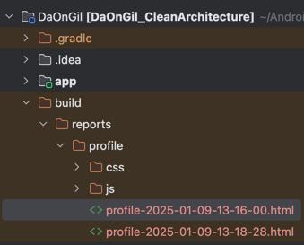
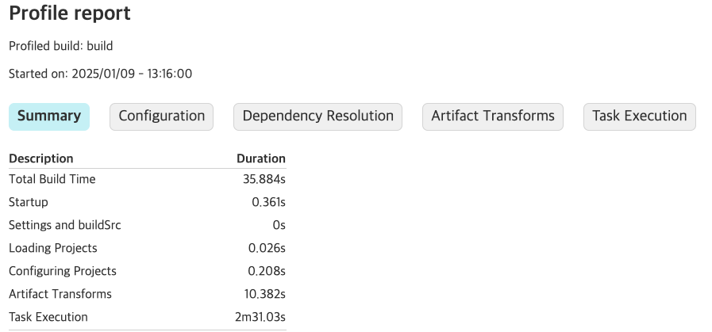

## 멀티 모듈 빌드 속도 최적화

### 증분 빌드
+ Gradle은 incremental build(증분빌드)를 지향한다.
> 재빌드시 이전 빌드와 비교해 필요한 부분만 빌드
+ 이 때 필요한 부분만 빌드하도록 local Cache하는 것을 **build cache**

### 빌드 속도 측정
공식문서 링크 : https://developer.android.com/build/profile-your-build?hl=ko#using-the-gradle---profile-option

```
./gradlew clean build --profile
./gradlew build --profile
```
+ 빌드 프로 파일링시 필요한 부분만 빌드하므로 정확한 빌드 속도 측정을 위해서 클린 빌드를 실행해야 한다.
+ 측정 결과는 프로젝트 루트의 /build/reports/profile/ 에서 확인할 수 있다.



<br/>

### **기본 빌드 프로파일링 결과**


### 빌드 속도 최적화 옵션
- 다음 설정을 gradle.properties에 추가한다.

<br/>

### **1. 빌드 캐싱 기본 설정**
```
org.gradle.caching=true
```

### **2. Gradle 데몬 활성화**
```
org.gradle.daemon=true
```
- 데몬 프로세스를 사용를 여부 설정헤 빌드 초기화 시간을 단축한다.
- 반복적으로 빌드하는 프로젝트에서 유용 하다.

### **3. 병렬 빌드 활성화**
```
org.gradle.parallel=true
```
- CPU 코어를 최대한 활용해 병렬 빌드를 활성화한다.
- 멀티모듈 프로젝트에서 빌드 시간을 단축한다.

### **4.**
```
org.gradle.configureondemand
```
- 관련 프로젝트가 있다면 필요한 부분만 빌드 설정한다.

### 5. 모든 옵션을 설정한 결과

