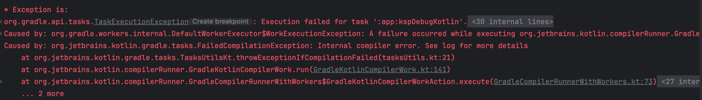

## KSP Trouble Shooting



### 1. 발생 에러 
```
* Exception is:
org.gradle.api.tasks.TaskExecutionException: Execution failed for task ':app:kspDebugKotlin'.
	at org.gradle.api.internal.tasks.execution.ExecuteActionsTaskExecuter.lambda$executeIfValid$1(ExecuteActionsTaskExecuter.java:149) 
```

### 2. 원인 분석
```
ksp = "1.9.25-1.0.20"
kotlin = "1.9.22"
```

+ KSP와 Kotlin은 동일한 마이너 버전을 사용해야 한다.
+ 현재 두 버전이 다르기 때문에 해당 문제가 발생했다.

### 3. 문제 해결

다음 공식 문서에 발표된 버전을 참고하여 수정하자
https://github.com/google/ksp/releases

```
kotlin = "1.9.22"
ksp = "1.9.22-1.0.10"
```
